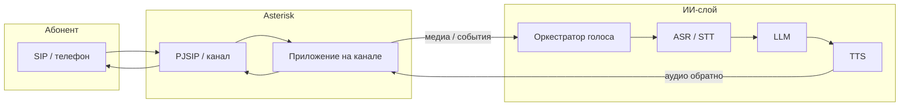
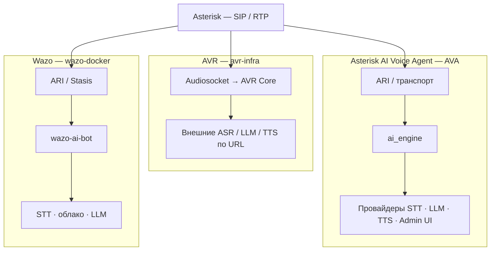
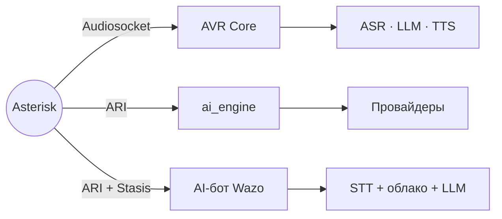

# Asterisk и голосовой ИИ: три подхода

В этом репозитории собраны **три независимые линии разработки** вокруг Asterisk и интеграции с ИИ. Каждая линия ведётся как **форк и доработка** соответствующего открытого проекта: добавлены улучшения, интеграции и правки под практические задачи; **исходные апстримы** указаны ниже — приоритет документации и отчётности об ошибках для базовой функциональности остаётся за ними.

## Официальные репозитории

| Локальный каталог | Апстрим | Назначение |
|-------------------|---------|------------|
| [`sip-service-poc/`](./sip-service-poc/README.md) | [**wazo-platform/wazo-docker**](https://github.com/wazo-platform/wazo-docker) | Docker-окружение платформы **Wazo**: Asterisk, сервисы UC, в этой ветке — дополнения вроде AI-бота и speech-to-text. |
| [`AVR/`](./AVR/README.md) | [**agentvoiceresponse/avr-infra**](https://github.com/agentvoiceresponse/avr-infra) | **Agent Voice Response (AVR)**: Asterisk, **AVR Core**, подключаемые ASR / LLM / TTS (или speech-to-speech) через **Audiosocket**. |
| [`Asterisk-AI-Voice-Agent/`](./Asterisk-AI-Voice-Agent/README.md) | [**hkjarral/AVA-AI-Voice-Agent-for-Asterisk**](https://github.com/hkjarral/AVA-AI-Voice-Agent-for-Asterisk) | **Asterisk AI Voice Agent (AVA)**: **ai_engine**, Admin UI, ARI/FreePBX, модульные pipeline’ы STT/LLM/TTS. |

---

## Сравнение концепций

| | **AVR** ([avr-infra](https://github.com/agentvoiceresponse/avr-infra)) | **Asterisk AI Voice Agent** ([AVA](https://github.com/hkjarral/AVA-AI-Voice-Agent-for-Asterisk)) | **Wazo + бот** ([wazo-docker](https://github.com/wazo-platform/wazo-docker)) |
|---|----------------|--------------------------------|---------------|
| **Идея** | Голосовой **конвейер**: поток аудио из Asterisk, цепочка ASR → LLM → TTS или единый **STS**. | **Платформа агента**: **ai_engine**, Admin UI, мастер настройки, golden baselines. | **UC-платформа Wazo** + сервисы голосового бота и распознавания в составе compose. |
| **Связь с Asterisk** | В типичном сценарии — **Audiosocket** к AVR Core; ARI — в расширенных/смежных сценариях. | **ARI** и согласованный транспорт к **ai_engine** (в т.ч. AudioSocket / ExternalMedia RTP — см. [Transport-Mode-Compatibility](https://github.com/hkjarral/AVA-AI-Voice-Agent-for-Asterisk/blob/main/docs/Transport-Mode-Compatibility.md)). | **ARI + Stasis**: приложение на канале, оркестрация в экосистеме Wazo/Asterisk. |
| **Оркестрация ИИ** | **AVR Core** + URL внешних сервисов (`ASR_URL`, `LLM_URL`, `TTS_URL` или `STS_URL`). | **ai_engine** + провайдеры из UI и YAML. | Сервисы бота, STT (например отдельный контейнер), облачные API по переменным окружения. |
| **Масштаб** | Набор контейнеров по выбранному `docker-compose-*.yml`; опционально **avr-app**. | Compose: Admin UI, **ai_engine**, опционально локальный AI и др. | Полный стек Wazo: БД, очереди, auth, Asterisk, reverse proxy и т.д. |
| **Типичный выбор** | Максимальная **сменяемость провайдеров** без тяжёлой АТС. | **Панель**, сценарии Asterisk/FreePBX, готовые профили. | **Wazo как АТС** (пользователи, линии, очереди) и бот как часть платформы. |

---

## Схема: входящий звонок → Asterisk → ИИ

Общая логика: абонент по **SIP** попадает в **Asterisk**, вызов обрабатывается **приложением** на канале, речь **распознаётся**, **LLM** формирует ответ, **TTS** возвращает аудио в разговор. Различаются **механизм подключения** (Audiosocket, ARI, Stasis) и **где выполняется оркестрация**.

### Соответствие трём линиям (форкам)

Краткая карта ветвления от одного Asterisk:

---

## Документация и быстрый старт

| Линия | Обзор | Пошаговый запуск | Апстрим |
|-------|--------|------------------|---------|
| AVR | [AVR/README.md](./AVR/README.md) | [AVR/SETUP.md](./AVR/SETUP.md) | [agentvoiceresponse/avr-infra](https://github.com/agentvoiceresponse/avr-infra) |
| Asterisk AI Voice Agent | [Asterisk-AI-Voice-Agent/README.md](./Asterisk-AI-Voice-Agent/README.md) | [Asterisk-AI-Voice-Agent/SETUP.md](./Asterisk-AI-Voice-Agent/SETUP.md) | [hkjarral/AVA-AI-Voice-Agent-for-Asterisk](https://github.com/hkjarral/AVA-AI-Voice-Agent-for-Asterisk/tree/main) |
| Wazo / AI Bot | [sip-service-poc/README.md](./sip-service-poc/README.md) | [sip-service-poc/SETUP.md](./sip-service-poc/SETUP.md) | [wazo-platform/wazo-docker](https://github.com/wazo-platform/wazo-docker) |
| Общий образ Asterisk (light, Docker) | [Asterisk/README.md](./Asterisk/README.md) | сборка и `docker run` в README; пример — [scripts/run-asterisk-example.sh](./Asterisk/scripts/run-asterisk-example.sh) | тот же `Dockerfile-asterisk`, что и у AVA (см. README каталога) |

Рекомендуемый порядок: открыть **SETUP.md** выбранной линии, затем при необходимости углубиться в апстрим (README, `verify.sh`, `preflight.sh`, официальные docs).
